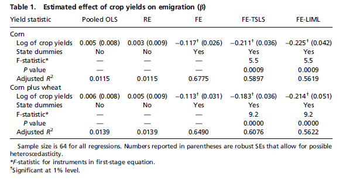
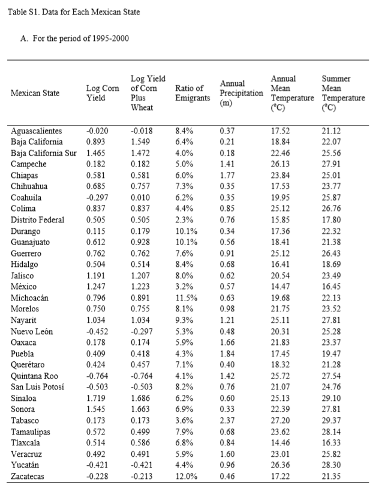
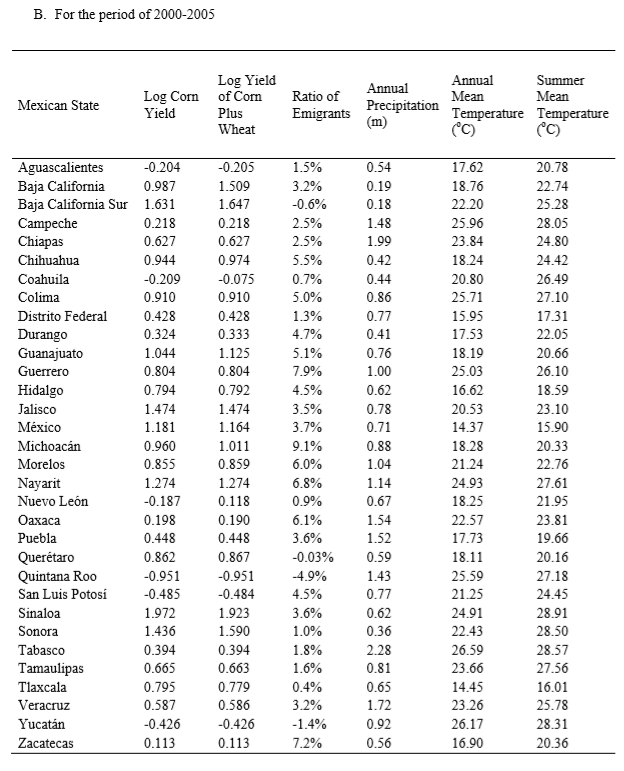

# Executive Summary / Write-Up

## Objective

Our objective was to reproduce, as much as possible and given the supplementary material, the results of the Feng et al paper, which can be found summarized in Table 1 (14258), with robustness checks in Table 2 (14259).  Table 1 is displayed below:




## Progress and Stumbling Blocks

First, given all the papers we’ve read with data and scripts that were, however flawed, available online, it was surprising to see that this was not the case for the paper.  Although the supplementary material was much appreciated, as it makes it easier to understand the context of the data, it is impossible to know whether one was taking the same steps as the authors without having access to the code the authors used itself.

The second stumbling block came when trying to download the emigration data from the website of [Integrated Public Use Microdata Series - International (IPUMS)](https://international.ipums.org/international/).  Unfortunately, downloading data from the website required creating an account that is still pending approval.  We therefore proceed using two methods:

1. First, we manually type in the data presented in “Table S1. Data for Each Mexican State,” presented below:





2. Second, we download data from Mexico’s [National Institute of Statistics and Geography](http://www.beta.inegi.org.mx/proyectos/ccpv/2000/default.html), abbreviated INEGI based on the Spanish spelling.  We obtain data from each of the “Censo General de Población y Vivienda” (General Population and Housing Census) 1995, 2000, and 2005 (XI, XII, and XIII), and navigate to “Tabulados” (Tabulations) and filter the results by “Interactivos (cubos)” (cubed interactive groups) and “Area Geográfica” “Nacional y Entidad Federativa” (Geography: National and State).  Then we run a consultation on “Poblacion total con estimación” (Total population with estimation) by “Entidad municipio y loc” (Municipal entity and locale) and “Edad quinquenal” (Age by five-year groupings).  We then export the results to .csv, clean the data by eliminating non-data rows and columns, and import into R.  We are able to obtain total population data this way.  However, we realize that obtaining the data for projections of death rates and for migration turns out to be too time-consuming and death rates too unclear that we resort to using the first method described above to test the regression part of the analysis first.

We finish by trying to run the regressions described in the paper on the manually inputted data.


## Results

It is interesting to note that the log yield of corn plus wheat for Veracruz was lower than the log yield of just corn for the years 2000 to 2005.  This calls into question the data presented in the charts, and emphasizes the need for current or future replication attempts to really get to the source.

We first test for a reduced form relationship between climate and migration based on Part 3 of the supplemental data, creating quadratic equations as necessary.  Using the numbers provided and the plm package, we actually get results for the pooled OLS that are different from the reported results in Table S2. The results are closer when we run Fixed Effects, even though the estimates are still slightly off here.

Turning our attention to testing the two-stage least squares, with both fixed effects and without, we get results that are generally an order of magnitude lower and statistically insignificant, though in the same general direction as the results of the main study.


# Code

## Setup

Begin by loading the required packages and data, and defining necessary project settings.

```{r Setup}
# Set seed
knitr::opts_chunk$set(set.seed(123456789))

# Install and load useful libraries
# install.packages("pacman")
library(pacman)

p_load(readr, lubridate, ggplot2, stargazer, fastDummies, pdftools,  
       foreign, pander, knitr, purrr, tidyverse, tidyselect, stringr, 
       xlsx, plm)
```

Next, we construct the emigration data using the residual approach mentioned in the [Supplementary Material](http://www.pnas.org/content/pnas/suppl/2010/07/18/1002632107.DCSupplemental/sapp.pdf).  

We try to obtain population and emigration data from the [Integrated Public Use Microdata Series - International (IPUMS)](https://international.ipums.org/international/), but, failing that, obtain it from .csv files downloaded from Mexico’s [National Institute of Statistics and Geography](http://www.beta.inegi.org.mx/proyectos/ccpv/2000/default.html) (INEGI).  

```{r Load Emigration Data}

# Download 1995 - 2005 total population by state and age group
popMX1995 <- read_csv("INEGI_Exporta_20181009014955_1995.csv")
popMX2000 <- read_csv("INEGI_Exporta_20181009020938_2000.csv")
popMX2005 <- read_csv("INEGI_Exporta_20181009021100_2005.csv")

```

Since we only obtain population data in this manner, we resort to manually copying the data from the PDF file.  We copy both the emigration data and the crop data in this way to test the regressions, and then return to trying to construct the dataset from the sources provided.

```{r Manual Dataset}
# Hand-writing Table S1 data for 1995-2000 and 2000-2005
mexicanState <- c("Aguascalientes", "Baja California", "Baja California Sur", "Campeche", "Chiapas", "Chihuahua", "Coahuila", "Colima", "Distrito Federal", "Durango", "Guanajuato", "Guerrero", "Hidalgo", "Jalisco", "Mexico", "Michoacan", "Morelos", "Nayarit", "Nuevo Leon", "Oaxaca", "Puebla", "Queretaro", "Quintana Roo", "San Luis Potosi", "Sinaloa", "Sonora", "Tabasco", "Tamaulipas", "Tlaxcala", "Veracruz", "Yucatan", "Zacatecas")

timePeriod1995to2000 <- rep("1995-2000", length(mexicanState))
timePeriod2000to2005 <- rep("2000-2005", length(mexicanState))

logCornYield1995to2000 <- 
  c(-0.020, 0.893, 1.465, 0.182, 0.581, 0.685, -0.297, 0.837, 0.505, 
    0.115, 0.612, 0.762, 0.504, 1.191, 1.247, 0.796, 0.750, 1.034,
    -0.452, 0.178, 0.409, 0.424, -0.764, -0.503, 1.719, 1.545, 0.173,
    0.572, 0.514, 0.492, -0.421, -0.228)

logYieldOfCornPlusWheat1995to2000 <- 
  c(-0.018, 1.549, 1.472, 0.182, 0.581, 0.757, 0.010, 0.837, 0.505, 
    0.179, 0.928, 0.762, 0.514, 1.207, 1.223, 0.891, 0.755, 1.034,
    -0.297, 0.174, 0.418, 0.457, -0.764, -0.503, 1.686, 1.663, 0.173,
    0.499, 0.586, 0.491, -0.421, -0.213)

ratioOfEmigrants1995to2000 <- 
  c(0.084, 0.064, 0.040, 0.050, 0.060, 0.073, 0.062, 0.044, 0.023, 
    0.101, 0.101, 0.076, 0.084, 0.080, 0.032, 0.115, 0.081, 0.093,
    0.053, 0.059, 0.043, 0.071, 0.041, 0.082, 0.062, 0.069, 0.036,
    0.079, 0.068, 0.059, 0.044, 0.120)

annualPrecipitation1995to2000 <- 
  c(0.37, 0.21, 0.18, 1.41, 1.77, 0.35, 0.35, 0.85, 0.76, 0.34, 0.56,
    0.91, 0.68, 0.62, 0.57, 0.63, 0.98, 1.21, 0.48, 1.66, 1.84, 0.40,
    1.42, 0.76, 0.60, 0.33, 2.37, 0.68, 0.84, 1.60, 0.96, 0.46)

annualMeanTemp1995to2000 <-
  c(17.52, 18.84, 22.46, 26.13, 23.84, 17.53, 19.95, 25.12, 15.85,
    17.36, 18.41, 25.12, 16.41, 20.54, 14.47, 19.68, 21.75, 25.11,
    20.31, 21.83, 17.45, 18.32, 25.72, 21.07, 25.13, 22.39, 27.20,
    23.62, 14.46, 23.01, 26.36, 17.22)

summerMeanTemp1995to2000 <- 
  c(21.12, 22.07, 25.56, 27.91, 25.01, 23.77, 25.87, 26.76, 17.80,
    22.32, 21.38, 26.43, 18.69, 23.49, 16.45, 22.13, 23.52, 27.81,
    25.28, 23.37, 19.47, 21.28, 27.54, 24.76, 29.10, 27.81, 29.37,
    28.14, 16.33, 25.82, 28.30, 21.35)

logCornYield2000to2005 <- 
  c(-0.204, 0.987, 1.631, 0.218, 0.627, 0.944, -0.209, 0.910, 0.428,
    0.324, 1.044, 0.804, 0.794, 1.474, 1.181, 0.960, 0.855, 1.274,
    -0.187, 0.198, 0.448, 0.862, -0.951, -0.485, 1.972, 1.436, 0.394,
    0.665, 0.795, 0.587, -0.426, 0.113)

# Why is the log yield of corn plus wheat lower than the log yield of corn?
logYieldOfCornPlusWheat2000to2005 <- 
  c(-0.205, 1.509, 1.647, 0.218, 0.627, 0.974, -0.075, 0.910, 0.428,
    0.333, 1.125, 0.804, 0.792, 1.474, 1.164, 1.011, 0.859, 1.274, 
    0.118, 0.190, 0.448, 0.867, -0.951, -0.484, 1.923, 1.590, 0.394, 
    0.663, 0.779, 0.586, -0.426, 0.113)

ratioOfEmigrants2000to2005 <- 
  c(0.015, 0.032, -0.006, 0.025, 0.025, 0.055, 0.007, 0.050, 0.013,
    0.047, 0.051, 0.079, 0.045, 0.035, 0.037, 0.091, 0.060, 0.068, 
    0.009, 0.061, 0.036, -0.003, -0.049, 0.045, 0.036, 0.010, 0.018,
    0.016, 0.004, 0.032, -0.014, 0.072)

annualPrecipitation2000to2005 <- 
  c(0.54, 0.19, 0.18, 1.48, 1.99, 0.42, 0.44, 0.86, 0.77, 0.41, 0.76,
    1.00, 0.62, 0.78, 0.71, 0.88, 1.04, 1.14, 0.67, 1.54, 1.52, 0.59,
    1.43, 0.77, 0.62, 0.36, 2.28, 0.81, 0.65, 1.72, 0.92, 0.56)

annualMeanTemp2000to2005 <-
  c(17.62, 18.76, 22.20, 25.96, 23.84, 18.24, 20.80, 25.71, 15.95, 
    17.53, 18.19, 25.03, 16.62, 20.53, 14.37, 18.28, 21.24, 24.93, 
    18.25, 22.57, 17.73, 18.11, 25.59, 21.25, 24.91, 22.43, 26.59, 
    23.66, 14.45, 23.26, 26.17, 16.90) 

summerMeanTemp2000to2005 <- 
  c(20.78, 22.74, 25.28, 28.05, 24.80, 24.42, 26.49, 27.10, 17.31,
    22.05, 20.66, 26.10, 18.59, 23.10, 15.90, 20.33, 22.76, 27.61, 
    21.95, 23.81, 19.66, 20.16, 27.18, 24.45, 28.91, 28.50, 28.57,
    27.56, 16.01, 25.78, 28.31, 20.36)

tbl1995to2000 <- 
  tibble(mexicanState = mexicanState, 
         timePeriod = timePeriod1995to2000,
         logCornYield = logCornYield1995to2000,
         logYieldOfCornPlusWheat = logYieldOfCornPlusWheat1995to2000,
         ratioOfEmigrants = ratioOfEmigrants1995to2000,
         annualPrecipitation = annualPrecipitation1995to2000, 
         annualMeanTemp = annualMeanTemp1995to2000,
         summerMeanTemp = summerMeanTemp1995to2000)

tbl2000to2005 <- 
  tibble(mexicanState = mexicanState, 
         timePeriod = timePeriod2000to2005,
         logCornYield = logCornYield2000to2005,
         logYieldOfCornPlusWheat = logYieldOfCornPlusWheat2000to2005,
         ratioOfEmigrants = ratioOfEmigrants2000to2005,
         annualPrecipitation = annualPrecipitation2000to2005, 
         annualMeanTemp = annualMeanTemp2000to2005,
         summerMeanTemp = summerMeanTemp2000to2005)

dfMXTot <- bind_rows(tbl1995to2000, tbl2000to2005)

```

## Replication

Now we test for a reduced form relationship between climate and migration based on Part 3 of the supplemental data, creating quadratic equations as necessary.

```{r Replicate Reduced-Form Equations}
# Create additional variables
dfMXTotEdit <- dfMXTot %>% 
  mutate(annualPrecipSq = (annualPrecipitation^2),
         annualMeanTempSq = (annualMeanTemp^2) / 100,
         summerMeanTempSq = (summerMeanTemp^2) / 100)
      
pooledReducedForm <- 
  plm(ratioOfEmigrants ~ annualPrecipitation + annualPrecipSq + 
        annualMeanTemp + annualMeanTempSq + summerMeanTemp + 
        summerMeanTempSq, data = dfMXTotEdit)

summary(pooledReducedForm)

feReducedForm <- 
  lm(ratioOfEmigrants ~ annualPrecipitation + annualPrecipSq + 
        annualMeanTemp + annualMeanTempSq + summerMeanTemp + 
        summerMeanTempSq + factor(mexicanState), data = dfMXTotEdit)

summary(feReducedForm)

```


Using the numbers provided and the plm package, we actually get results for the pooled OLS that are different from the reported results in Table S2. The results are closer when we run Fixed Effects, even though the estimates are still slightly off here.

Manually running a two-stage least squares fixed effects estimate, we obtain the following:

```{r FE-TSLS}
# For Corn only
firstStageCorn <- 
  lm(logCornYield ~ annualPrecipitation + annualPrecipSq + 
        annualMeanTemp + annualMeanTempSq + summerMeanTemp + 
        summerMeanTempSq, data = dfMXTotEdit)

# For Corn + Wheat
firstStageCornPlusWheat <- 
  lm(logYieldOfCornPlusWheat ~ annualPrecipitation + annualPrecipSq + 
        annualMeanTemp + annualMeanTempSq + summerMeanTemp + 
        summerMeanTempSq, data = dfMXTotEdit)

dfMXTotEdit2 <- dfMXTotEdit %>% 
  mutate(logCornYieldIV = firstStageCorn$fitted.values,
         logYieldOfCornPlusWheatIV = firstStageCornPlusWheat$fitted.values)

#Corn
secondStageCornFE <- 
  lm(ratioOfEmigrants ~ logCornYieldIV + factor(mexicanState) + factor(timePeriod),
     data = dfMXTotEdit2)

secondStageCornPLM <- 
  plm(ratioOfEmigrants ~ logCornYieldIV,
     data = dfMXTotEdit2)

#Corn + Wheat
secondStageCornPlusWheatFE <- 
  lm(ratioOfEmigrants ~ logYieldOfCornPlusWheatIV + factor(mexicanState) + factor(timePeriod),
     data = dfMXTotEdit2)

secondStageCornPlusWheatPLM <- 
  plm(ratioOfEmigrants ~ logYieldOfCornPlusWheatIV,
     data = dfMXTotEdit2)

results <- list(secondStageCornFE, secondStageCornPLM,
                secondStageCornPlusWheatFE, secondStageCornPlusWheatPLM)

map(results, summary)

```

With both fixed effects and without, we get results that are generally an order of magnitude lower and statistically insignificant, though in the same general direction as the results of the main study.